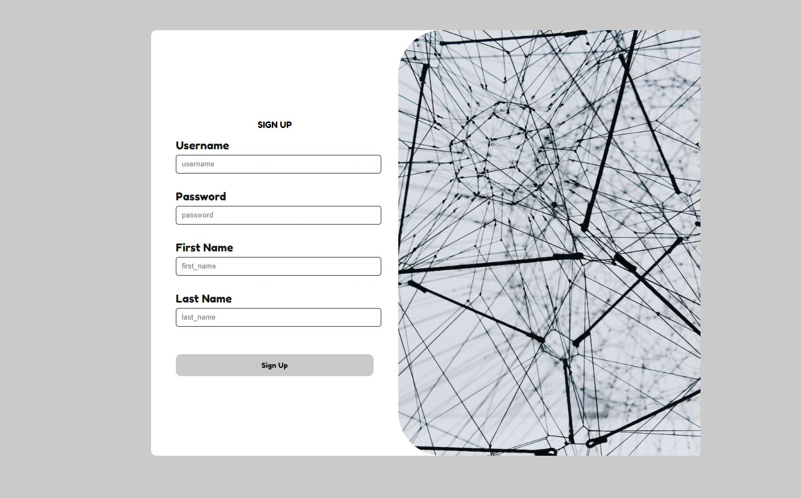
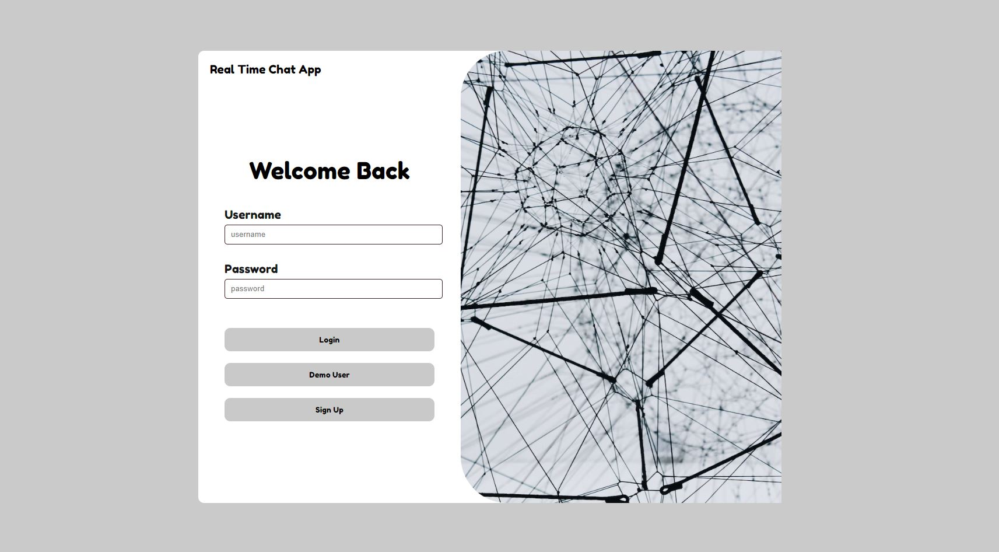
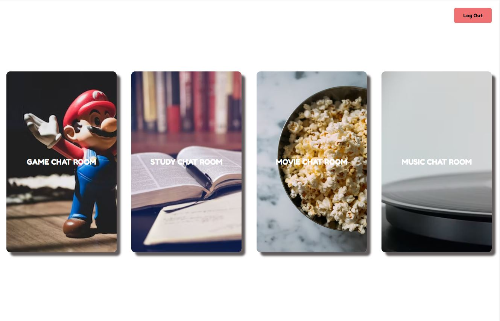
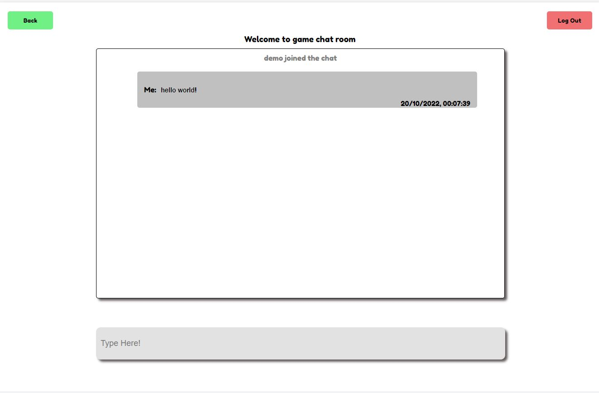

# Django Realtime Group Chat App

# Important

Note: While this chat app is still functional, I recommend checking out my newest chat app built using express.js, node.js, and socket.io for a more advanced experience. My new app includes more features and a cleaner user interface. You can find my new group chat app at https://github.com/andyzhp234/QuickChat.

# User Experience

# Technologies

- Heroku
- REACT
- REACT Context
- REACT Hook
- Node.js
- JWT
- Axios
- Django
- Django Restframework
- Django Restframework-simplejwt
- Django Channel (daphne)
- SQLite
- Redis

Thank you for taking the time to visit this GitHub repository.
